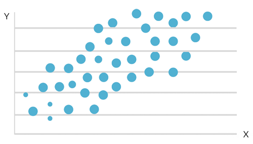

    
    <h1 style="color: #FFFFFF; font-family: courier; font-size: 4em;"><b>Regression Models</b></h1>

    

# Content

This repository contains only projects using regression analysis techniques.

* linear logistic regression baseball
* linear regression intro case study
* linear regression project
* linear regression visually differentiating pca
* linear regression vs gradient boosting regressor
* linear regression
* logistic regression intro
* logistic regression project

## Vitor (Meriat) 🎓 🐍 🔬

### Contact Information

Feel free to contact me:

[Vitor Meriat](http://www.vitormeriat.com.br/) is a computer scientist who is passionate about creating software that will positively change the world we live in.

:alien: <a class="fa fa-twitter" aria-hidden="true" href="https://twitter.com/vitormeriat" target="_blank"> twitter</a> | <a class="fa fa-facebook" aria-hidden="true" href="https://www.facebook.com/vitormeriat/" target="_blank"> facebook</a> | <a class="fa fa-instagram" aria-hidden="true" href="https://www.instagram.com/vitormeriat/" target="_blank"> instagram</a> | <a class="fa fa-linkedin" aria-hidden="true" href="https://www.linkedin.com/in/vitormeriat" target="_blank"> linkedin</a> | <a class="fa fa-youtube" aria-hidden="true" href="https://www.youtube.com/user/vitormeriat/" target="_blank"> youtube</a>